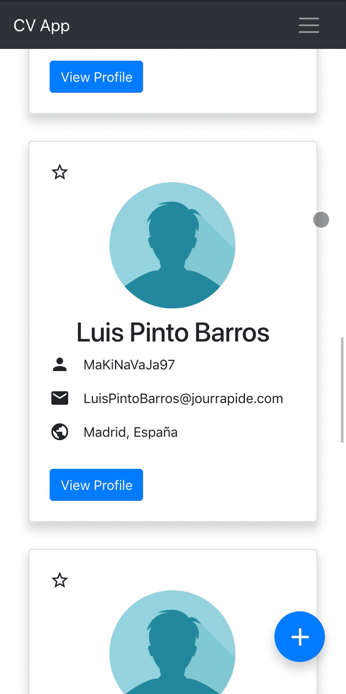
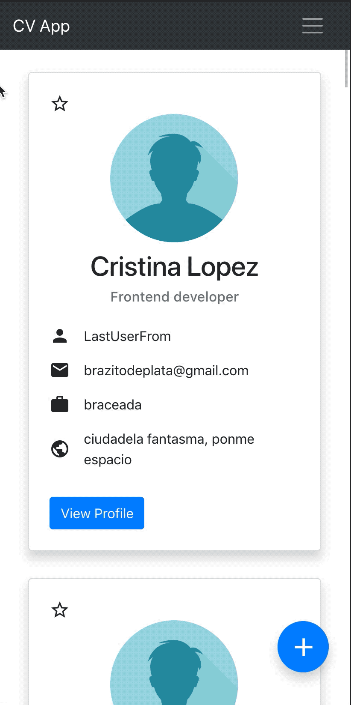

### Infinite scroll

The first functionality I was in charge of, was to create an infinite scroll home page that was able to render student profiles in blocks of ten so when the user reaches the bottom of the page it loaded ten more student profiles until there weren't more profiles to load from the server. The approach I took in this occasion was to attach an event listener to the main container where the profiles was loaded and made a calculation with the scroll position of it and the window height, and then fire a data fetch with a dynamic link that changes for every request avoiding fetching the same users twice.

### Quick search

Another functionality I was in charge of develop was to add a quick search bar on the main page to find users that are already loaded from the server. This search had to find coincidences at the same time on the user's name, username, email and company. Finally, the coincidence of each user is highlighted to help the user find what he's looking for.
